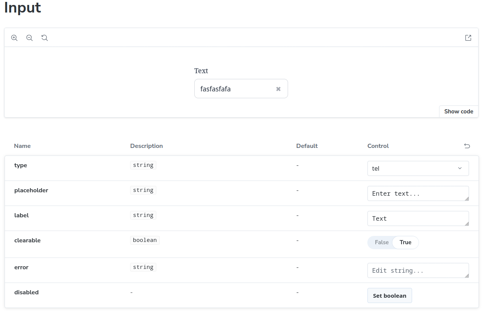
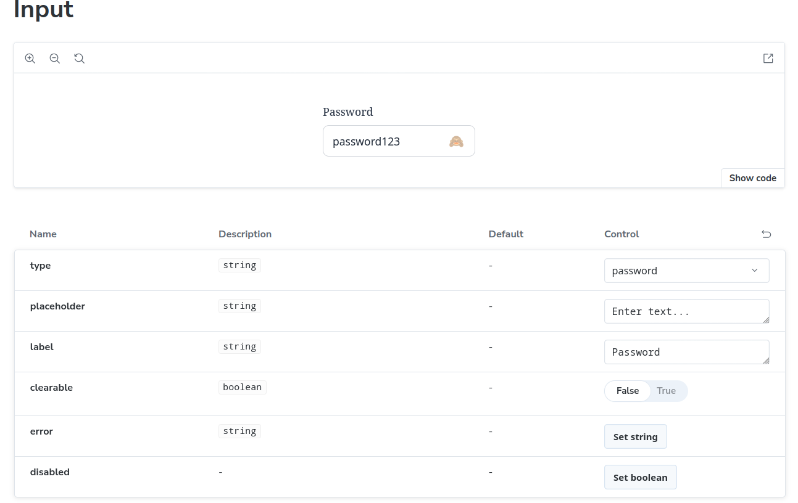
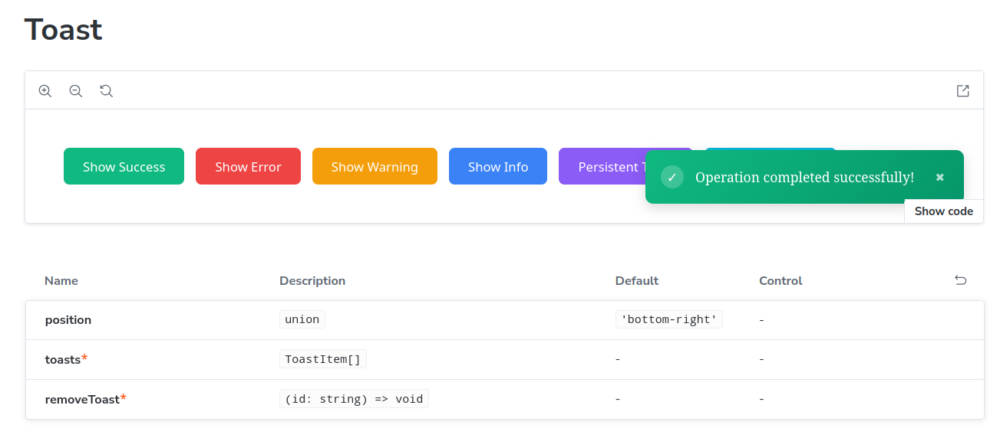
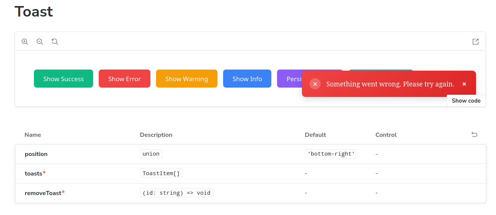
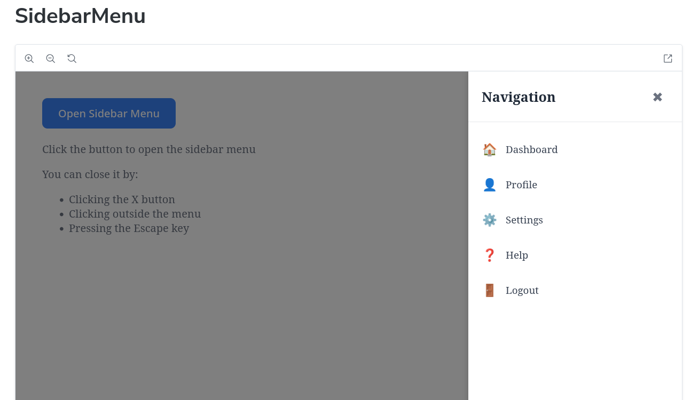
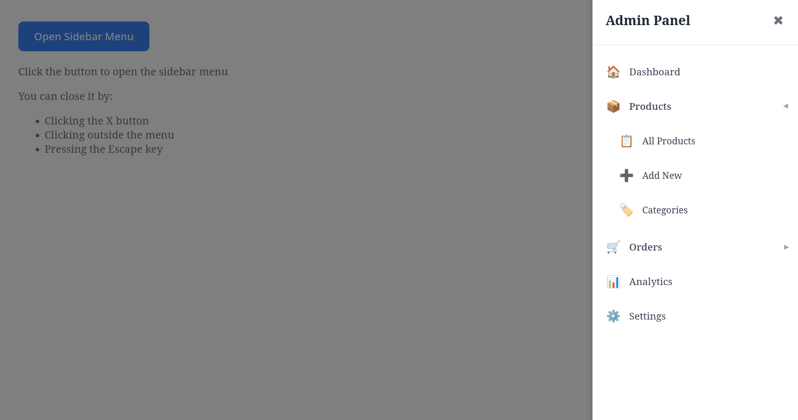

```bash
# Install dependencies
npm install

# Start Storybook
npm run storybook
```

Storybook will open at `http://localhost:6006`

## 📦 Components

### 1. Input Component

A versatile input component with multiple features:

**Features:**

- Multiple input types (text, password, email, number, tel, url)
- Password visibility toggle with eye icon
- Clearable option with X button
- Label and error message support
- Disabled state
- Fully controlled and uncontrolled modes

**Props:**

```typescript
type InputProps = {
	type?: 'text' | 'password' | 'email' | 'number' | 'tel' | 'url'
	clearable?: boolean
	label?: string
	error?: string
	disabled?: boolean
	// ... all standard HTML input attributes
}
```

**Usage:**

```tsx
import { Input } from './components/Input/Input'
;<Input
	type='password'
	label='Password'
	clearable
	placeholder='Enter password...'
/>
```

**Screenshots:**




---

### 2. Toast Component

A notification system with auto-dismiss and animations.

**Features:**

- 4 types: success, error, warning, info
- Configurable duration (or persistent with duration=0)
- Slide-in/slide-out animations
- Optional close button
- Multiple positioning options
- Stackable notifications

**Props:**

```typescript
type ToastProps = {
	type: 'success' | 'error' | 'warning' | 'info'
	message: string
	duration?: number
	closeable?: boolean
}
```

**Usage:**

```tsx
import { useToast, ToastContainer } from './components/Toast'

function App() {
	const { toasts, addToast, removeToast } = useToast()

	return (
		<>
			<button
				onClick={() =>
					addToast({
						type: 'success',
						message: 'Success!',
					})
				}
			>
				Show Toast
			</button>
			<ToastContainer
				position='bottom-right'
				toasts={toasts}
				removeToast={removeToast}
			/>
		</>
	)
}
```

**Screenshots:**




---

### 3. Sidebar Menu Component

A sliding sidebar with nested navigation support.

**Features:**

- Slides in from right with smooth animation
- Expandable/collapsible nested items (unlimited levels)
- Click outside to close
- Escape key support
- Icons support
- Scroll for long menus

**Props:**

```typescript
type MenuItem = {
	id: string
	label: string
	icon?: string
	items?: MenuItem[]
}

type SidebarMenuProps = {
	isOpen: boolean
	onClose: () => void
	items: MenuItem[]
	title?: string
}
```

**Usage:**

```tsx
import { SidebarMenu } from './components/SidebarMenu/SidebarMenu'

const menuItems = [
	{ id: '1', label: 'Dashboard', icon: '🏠' },
	{
		id: '2',
		label: 'Products',
		icon: '📦',
		items: [
			{ id: '2-1', label: 'All Products' },
			{ id: '2-2', label: 'Add New' },
		],
	},
]

;<SidebarMenu
	isOpen={isOpen}
	onClose={() => setIsOpen(false)}
	items={menuItems}
	title='Navigation'
/>
```

**Screenshots:**




---

## 🛠️ Development

### Available Scripts

```bash
# Start development server
npm run dev

# Start Storybook
npm run storybook

# Build for production
npm run build

# Build Storybook
npm run build-storybook

# Lint code
npm run lint

# Format code
npm run format
```

### Project Structure

```
src/
├── components/
│   ├── Input/
│   │   ├── Input.tsx
│   │   ├── Input.css
│   │   └── Input.stories.tsx
│   ├── Toast/
│   │   ├── hooks/
│   │   ├── Toast.tsx
│   │   ├── ToastContainer.tsx
│   │   ├── Toast.css
│   │   └── Toast.stories.tsx
│   └── SidebarMenu/
│       ├── SidebarMenu.tsx
│       ├── SidebarMenu.css
│       └── SidebarMenu.stories.tsx
```

## 🎨 Storybook

All components are documented in Storybook with interactive controls.

### Viewing Stories

1. Start Storybook: `npm run storybook`
2. Navigate to `http://localhost:6006`
3. Browse components in the sidebar
4. Use the Controls panel to modify props in real-time

### Story Organization

- **Components/Input** - All input variants
- **Components/Toast** - Toast notifications with different positions
- **Components/SidebarMenu** - Sidebar with various nesting levels

## 💅 Styling

All components use plain CSS with:

- CSS variables for easy theming
- Smooth animations and transitions
- Responsive design
- Accessible color contrasts

## ♿ Accessibility

Components follow accessibility best practices:

- Semantic HTML
- ARIA labels where needed
- Keyboard navigation support
- Focus indicators
- Screen reader friendly

## 🧪 Testing

Components are designed to be easily testable:

- Proper prop typing with TypeScript
- Controlled/uncontrolled patterns
- Predictable state management

## 📝 Code Quality

- **TypeScript** for type safety
- **ESLint** for code linting
- **Prettier** for code formatting
- **Consistent naming** conventions
- **Functional components** with hooks

## 🎯 Browser Support

- Chrome (latest)
- Firefox (latest)
- Safari (latest)
- Edge (latest)

---
